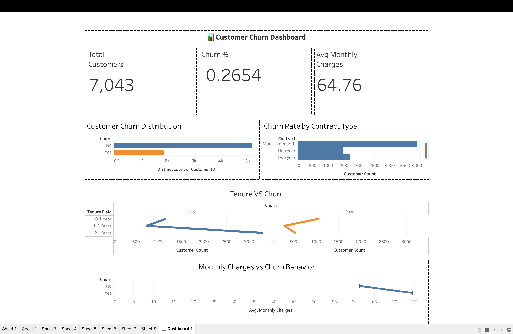

# 📊 Customer Churn Prediction & Analysis using Machine Learning

## 🚀 Overview

This project analyzes telecom customer churn using data analytics and machine learning to identify high-risk customers and improve retention strategies.

📌 Achieved:
- ~79% model accuracy
- Improved churn detection using threshold tuning
- Identified key drivers like tenure, contract type, and monthly charges

## 📊 Dashboard Preview



---

## 📈 Key Results

- Customers with tenure < 12 months have highest churn risk  
- Month-to-month contracts show significantly higher churn  
- High monthly charges strongly correlate with churn  

---

## 🎯 Key Highlights

* Cleaned and preprocessed telecom dataset (handled hidden missing values in `TotalCharges`)
* Performed EDA to uncover churn drivers
* Built classification models (Logistic Regression, Random Forest)
* Applied threshold tuning to improve churn detection
* Achieved ~79% accuracy with balanced precision and recall

---

## 🤖 Model Comparison

| Model              | Accuracy | Recall (Churn) |
|--------------------|----------|----------------|
| Logistic Regression| ~80%     | ~52%           |
| Random Forest      | ~79%     | ~61%           |

---

## ⚙️ Techniques Used

* Data Cleaning & Preprocessing
* Feature Encoding
* Exploratory Data Analysis
* Classification Modeling
* Threshold Optimization

---

## 🛠️ Tech Stack

* Python (Pandas, NumPy)
* Matplotlib, Seaborn
* Scikit-learn

---

## 📂 Project Structure

```
data/
notebook/
dashboard/
```

---

## 📊 Sample Visualizations


---

=======

## 💼 Business Impact

This analysis helps telecom companies:
- Identify at-risk customers early  
- Reduce churn through targeted interventions  
- Optimize retention costs  

---

## 🔮 Future Work

* Hyperparameter tuning
* Advanced models (XGBoost)
* Model deployment
