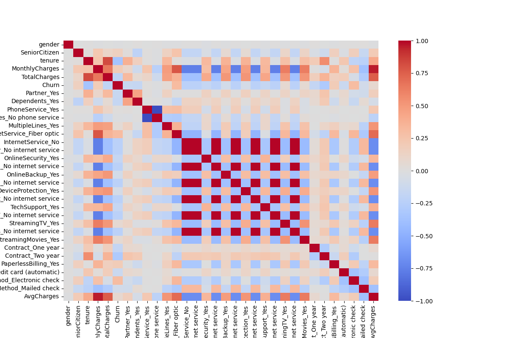

# 📊 Customer Churn Prediction & Analysis using Machine Learning

## 🚀 Overview

Analyzed customer churn behavior using data analytics and machine learning to identify key factors influencing customer retention.

---

## 🎯 Key Highlights

* Cleaned and preprocessed telecom dataset (handled hidden missing values in `TotalCharges`)
* Performed EDA to uncover churn drivers
* Built classification models (Logistic Regression, Random Forest)
* Applied threshold tuning to improve churn detection
* Achieved ~79% accuracy with balanced precision and recall

---

## 📊 Key Insights

* Customers with low tenure are more likely to churn
* High monthly charges increase churn probability
* Month-to-month contracts show highest churn rate

---

## 🤖 Model Performance

* Accuracy: ~79%
* Precision: ~59%
* Recall: ~61%

---

## ⚙️ Techniques Used

* Data Cleaning & Preprocessing
* Feature Encoding
* Exploratory Data Analysis
* Classification Modeling
* Threshold Optimization

---

## 🛠️ Tech Stack

* Python (Pandas, NumPy)
* Matplotlib, Seaborn
* Scikit-learn

---

## 📂 Project Structure

```
data/
notebook/
dashboard/
```

---

## 📊 Sample Visualizations



---

## 💼 Business Impact

Helps telecom companies identify at-risk customers and take proactive retention measures.

---

## 🔮 Future Work

* Hyperparameter tuning
* Advanced models (XGBoost)
* Model deployment
